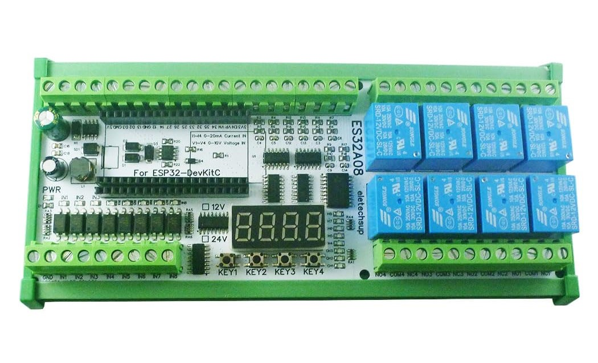

# ESPHome with ESP32 and ES32A08 Expansion Board

This repository provides examples on integrating the ESP32 microcontroller with the ES32A08 expansion board by eletechsup using ESPHome. This combination allows for versatile applications involving sensor input and output management suitable for DIY electronics projects.



## Board Features
- **8x Opto-isolated Inputs**: Low-level trigger, NPN type.
- **8x 10A Relay Outputs**
- **4x 0-5V/10V Voltage Input**
- **4x 0/4-20MA Current Input**
- **4x Buttons**
- **1x 4-bit Digital Tube Display**
- **RS485 Interface**: _(bugged, see [below](#rs485))_

## Examples
Below are examples demonstrating how to utilize each feature of the ES32A08 board.

### Base configurations
Some of the features on the board, are possible due to components like shift registers, so first, we need to define them

For outputs, there are 3 of [SN74HC595](https://esphome.io/components/sn74hc595) I/O expanders (shift registers).
```yaml
sn74hc595:
  - id: 'output_hub'
    data_pin: GPIO13
    clock_pin: GPIO27
    latch_pin: GPIO14
    oe_pin: GPIO4
    sr_count: 3
```

For inputs, there is 1 [SN74HC165](https://esphome.io/components/sn74hc165.html) I/O expander (shift register).
```yaml
sn74hc165:
  - id: 'input_hub'
    data_pin: GPIO5
    clock_pin: GPIO17
    load_pin: GPIO16
```


### Buttons
`KEY1` - `GPIO18`  
`KEY2` - `GPIO19`  
`KEY3` - `GPIO21`  
`KEY4` - `GPIO23`

```yaml
binary_sensor:
  - platform: gpio
    id: key_1
    name: "Key 1"
    internal: true
    pin: 
      number: GPIO18
      inverted: true
      mode:
        input: true
        pullup: true
    on_press:
      then:
        ...
```

### Opto-isolated Inputs
The opto-isolated inputs are available using the SN74HC165 shift register and use **pins 0 through 7**.

```yaml
binary_sensor:
  - platform: gpio
    id: input_1
    name: "Input 1"
    pin: 
      sn74hc165: 'input_hub'
      number: 0
      inverted: true
    on_press:
      then:
        ...
```

*Note: make sure that you define the [base configurations](#base-configurations) needed for this to work*

### Relay Outputs
The relays are avaiable using the SN74HC595 shift register and use **pins 16 through 23**.

```yaml
switch:
  - platform: gpio
    id: relay_1
    name: "Relay 1"
    pin:
      sn74hc595: 'output_hub'
      number: 16
```

*Note: make sure that you define the [base configurations](#base-configurations) needed for this to work*

### Status LED
I suggest using [Status LED Light](https://esphome.io/components/light/status_led.html) component, as it allows to share a single LED for indicating the status of the device (when on error/warning state) or as binary light.

```yaml
light: 
  - platform: status_led
    id: board_led
    name: "Board LED"
    pin: GPIO15
    internal: true
```

### Voltage Input
`V1` - `GPIO32`  
`V2` - `GPIO33`  
`V3` - `GPIO25`  
`V4` - `GPIO26`

> [!NOTE]  
> Inputs `V3` (`GPIO25`) and `V4` (`GPIO26`) can **not** be used, when `wifi:` is used.

```yaml
sensor:
  - platform: adc
    id: voltage_1
    name: "Voltage 1"
    update_interval: 30s
    attenuation: auto
    pin:
      number: GPIO32
      mode:
        input: true
    filters:
      # Converting what ESP sees to real value based on resistors that are used on the board
      - lambda: return x / 10.0 * (10.0 + 43.0);
      # Rounding to 2 decimals but feel free to change this if you need more/less pressicion
      - round: 2
      - delta: 0.01
```

### Current Input  
`I1` - `GPIO36`  
`I2` - `GPIO39`  
`I3` - `GPIO34`  
`I4` - `GPIO35`  

Here's an example with a 10-bar 4-20mA pressure sensor:

```yaml
sensor:
  - platform: adc
    id: pressure
    name: "Pressure"
    device_class: pressure
    state_class: measurement
    unit_of_measurement: bar
    accuracy_decimals: 2
    attenuation: 0db
    samples: 64
    pin:
      number: GPIO36
      mode:
        input: true
    filters:
      - lambda: !lambda |-
          if (isnan(x)) return NAN;

          float min_v = 0.364; // 4mA x 91R
          float max_v = 1.82; // 20mA x 91R
          float max_bar = 10.0;

          float bar = (x - min_v) * max_bar / (max_v - min_v);
          if (bar < 0.0) bar = 0.0;
          if (bar > max_bar) bar = max_bar;
          return bar;
      - round: 2
      - delta: 0.015
```

### RS485
After many hours of debugging, I discovered that the onboard RS485 interface on the ES32A08 board has a hardware issue causing signal loopback. This interferes with proper device communication and makes the built-in RS485 unusable.

For those who need RS485 functionality, check out https://github.com/makstech/esphome-es32a08-expansion-board-example/issues/2 where I discuss a possible workaround by using an external RS485 module soldered to the onboard button pins.

## Real-world examples

- [ESPHome Irrigation System](https://github.com/makstech/esphome-irrigation-system) – My own use-case for this board.

## Where to Buy
You can purchase the ES32A08 expansion board from the following links:

[AliExpress](https://s.click.aliexpress.com/e/_DBexHoH)  
[Amazon.com](https://www.amazon.com/Multifunction-Expansion-Digital-Arduino-Ethernet/dp/B0CM6HJCVQ?th=1)  
[eBay](https://www.ebay.com/itm/335132721050)  

### TODO
- [ ] Digital Tube Display example
- [ ] Full yaml example

## Contributing
Feel free to fork this repository and contribute by submitting pull requests.

## License
Distributed under the MIT License. See [LICENSE](LICENSE) for more information.
